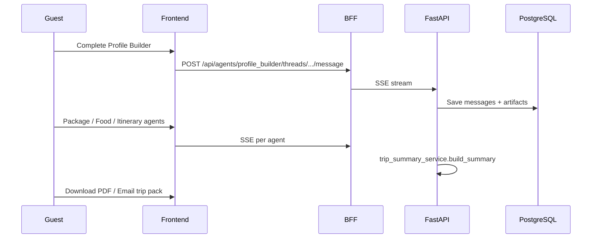

# Architecture

LeafyMind is a three-tier guest concierge for Leafy Cave: React frontend, Node BFF, Python FastAPI backend, and PostgreSQL.

---

## Design principles

1. **Single LLM gateway** — `services/llm_provider.py` is the only module that invokes LangChain / provider APIs.
2. **Agents do not call agents** — routing goes through `agents/orchestrator.py` (classic chat) or `services/agent_runner.py` (Agent Hub).
3. **Business rules before LLM creativity** — packages use `rules/business_rules.py`; attractions use `services/attraction_data_layer.py`.
4. **Secrets stay server-side** — API keys and SMTP credentials exist only in backend `.env`; the browser talks to the BFF.
5. **Warm, plain English** — guest-facing copy targets international tourists unfamiliar with Sri Lanka.

---

## Component responsibilities

### Frontend (`frontend/`)

- **Routes:** `/` landing, `/hub` dashboard, `/agents/:id` guided workspaces, `/chat` streaming concierge, `/owner` operations.
- **Auth:** JWT in `localStorage` (`leafymind_token`); Axios interceptor attaches `Authorization` header.
- **Streaming:** `fetch` + ReadableStream for SSE on agent and chat messages (POST, not EventSource).
- **Artifacts UI:** `PackageCard`, `FoodGuideCard`, `ItineraryTimeline`, `TripPackPanel`.

### BFF (`bff/`)

- Proxies `/api/*` to FastAPI with body streaming preserved.
- Global rate limit: 100 req / 15 min per IP (`/api/trip-pack` exempt).
- Auth routes: 10 req / min.
- WebSocket bridge for legacy chat path (`/ws/chat/:sessionId`).
- CORS from `CORS_ALLOWED_ORIGINS`.

### Backend (`backend/`)

| Module area | Responsibility |
|-------------|----------------|
| `api/` | HTTP routers: auth, agents, chat, recommendations, feedback, trip-pack |
| `agents/` | Profile, package, food, itinerary, feedback, orchestrator |
| `models/` | SQLAlchemy: users, sessions, threads, messages, packages, feedback |
| `services/` | LLM, journey, hub feedback, email, PDF, food images, KB, scheduler |
| `rules/` | Package scoring, travel-style aliases, custom package names |
| `db/migrations/` | Versioned SQL applied on Postgres init |

### Database

- **PostgreSQL 15** with async SQLAlchemy (`asyncpg`).
- Migrations in `db/migrations/` (001 initial → 005 packages meta).
- Agent Hub stores per-agent **threads** (`agent_threads`) with JSON **artifacts** and **guest_profile**.

---

## Two guest experiences

### Agent Hub (guided)

Journey state: `GET /api/agents/journey` via `JourneyService` + `TripSummaryService`.

### Classic chat (orchestrator)

- Phases: profiling → contact → recommending → itinerary → feedback.
- Single `sessions` row with `conversation_history` and phase field.
- Recommendations also exposed via `/api/recommendations/*/{sessionId}`.

---

## Knowledge base (FAISS)

- `services/knowledge_base.py` loads embeddings from packages, food, attractions.
- Default embeddings: `sentence-transformers/all-MiniLM-L6-v2` (local).
- Optional rebuild with OpenAI embeddings if `OPENAI_API_KEY` is set.
- Rebuild script: `python -m scripts.rebuild_kb`.

---

## External integrations

| Service | Used by | Config |
|---------|---------|--------|
| Groq | All LLM chat | `GROQ_API_KEY`, `LLM_MODEL` |
| Unsplash | Food image fallback | `UNSPLASH_ACCESS_KEY` |
| OpenTripMap | Itinerary discoveries | `OPENTRIPMAP_API_KEY`, cabana lat/lon |
| Gmail SMTP | Trip plan PDF + feedback emails | `GMAIL_*`, `FRONTEND_URL` |

---

## Docker volumes (development)

| Host path | Container path | Purpose |
|-----------|------------------|---------|
| `./backend` | `/app` | Hot reload Python |
| `./frontend` | `/app` | Vite dev server |
| `./frontend/public/images/food` | `/app/food_images` | PDF + food guide images |
| `./frontend/public` | `/app/public_assets` | Logo for PDF header |
| `./db/migrations` | `/app/migrations` | Schema init |

---

## Security boundary

See [SECURITY.md](../SECURITY.md). Summary:

- JWT on all routes except register/login/health.
- Pydantic validation on inputs; prompt sanitisation before LLM.
- No stack traces in API responses; `X-Request-ID` on every request.
