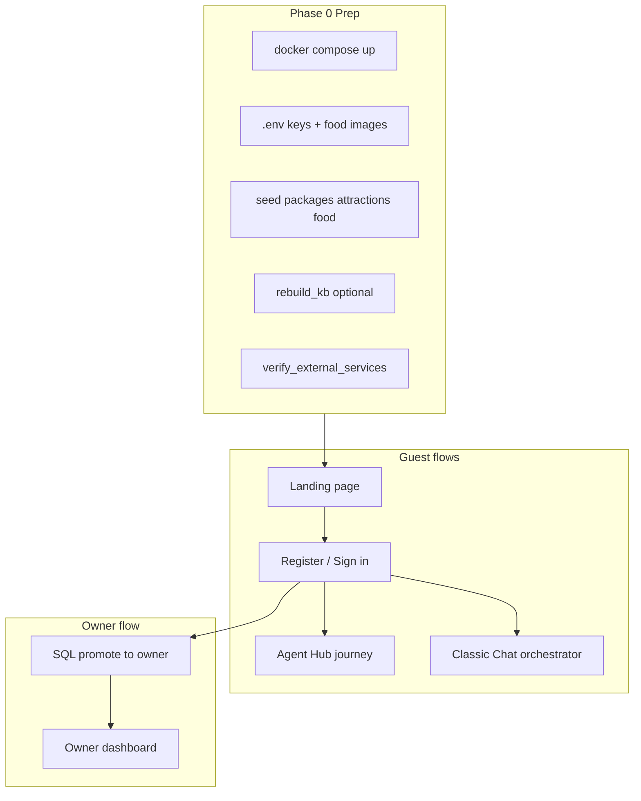

# Full application test plan (new user)

End-to-end checklist for LeafyMind. See also [docs/README.md](README.md) and [EXTERNAL_SERVICES_SETUP.md](EXTERNAL_SERVICES_SETUP.md).

Use this as an end-to-end checklist. Your stack URLs (from your [`.env`](../.env)):

| Service | URL |
|---------|-----|
| Frontend | http://localhost:5174 |
| BFF | http://localhost:3002/health |
| Backend | http://localhost:8010/health |
| API (browser) | http://localhost:3002/api |



## Automated scripts

Run these after Phase 0 setup (from repo root):

```powershell
# Phase 1–2 auth API checks
docker exec leafymind-backend python -m scripts.test_auth_smoke

# Phase 3 Agent Hub (guided specialists)
docker exec leafymind-backend python -m scripts.test_agent_hub_flow

# Phase 4 + 8 classic chat orchestrator
$env:INTEGRATION_API_BASE="http://127.0.0.1:8010"
docker exec -e INTEGRATION_API_BASE=http://host.docker.internal:8010 leafymind-backend python -m scripts.test_full_flow

# Phase 6 owner dashboard API
docker exec leafymind-backend python -m scripts.test_owner_dashboard

# Phase 7 feedback emails
docker exec leafymind-backend python -m scripts.send_feedback_emails_now
```

---

## Phase 0 — One-time setup (before testing)

### 0.1 Start containers

```powershell
cd "D:\Leafy Cave AI Project\LeafyMind"
docker compose down
docker compose up -d --build
docker compose ps
```

**Pass:** All four services healthy (`postgres`, `backend`, `bff`, `frontend`).

### 0.2 Environment and external APIs

Complete [EXTERNAL_SERVICES_SETUP.md](EXTERNAL_SERVICES_SETUP.md):

- `GROQ_API_KEY` (required)
- `UNSPLASH_ACCESS_KEY`, `OPENTRIPMAP_API_KEY`, `GMAIL_*` (required for full feature coverage)
- `FRONTEND_URL=http://localhost:5174`

Then:

```powershell
docker compose restart leafymind-backend
docker exec leafymind-backend python -m scripts.verify_external_services
```

**Pass:** Script ends with `All checks passed.`

### 0.3 Seed Leafy Cave data

```powershell
docker exec leafymind-backend python -m scripts.seed_packages
docker exec leafymind-backend python -m scripts.seed_attractions
docker exec leafymind-backend python -m scripts.seed_food
docker exec leafymind-backend python -m scripts.rebuild_kb
```

**Pass:** Each seed script prints success; KB rebuild completes without error.

### 0.4 Local food images

Add photos under [`frontend/public/images/food/`](../frontend/public/images/food/) per [`README.md`](../frontend/public/images/food/README.md) (at least 6 dishes). Restart backend after adding files.

### 0.5 Browser prep

- Use **Chrome/Edge** in normal window (not stale cache): hard refresh on first load (`Ctrl+Shift+R`).
- Open DevTools → **Network** (watch API calls to `localhost:3002`) and **Console** (no red errors on load).

---

## Phase 1 — Smoke tests (no login)

| Step | Action | Pass criteria |
|------|--------|----------------|
| 1.1 | Open http://localhost:5174/ | Landing page loads; logo, hero, sections visible |
| 1.2 | Click **Sign in** / **Get started** | Routes to `/signin` or `/register` |
| 1.3 | Visit http://localhost:3002/health | JSON `ok` or similar |
| 1.4 | Visit http://localhost:8010/health | HTTP 200 |

---

## Phase 2 — Guest account (auth)

Password rules ([SECURITY.md](../SECURITY.md)): min 8 chars, **one uppercase**, **one digit**.

| Step | Action | Pass criteria |
|------|--------|----------------|
| 2.1 | `/register` — create **Guest A** (e.g. `guest.test1@example.com`, `TestGuest1`) | 201 / redirect to hub; no console errors |
| 2.2 | Log out → `/signin` — wrong password | Clear error; not logged in |
| 2.3 | Sign in with correct password | Reaches `/hub`; sidebar shows name/email |
| 2.4 | Refresh page while logged in | Still authenticated (token in localStorage) |
| 2.5 | Log out | Redirected; `/hub` requires login again |

Optional security checks:

- 6 failed logins → “too many attempts” (429) per [SECURITY.md](../SECURITY.md)
- Password reset request (token logged in backend logs at MVP — not emailed unless you wire SMTP for reset)

---

## Phase 3 — Agent Hub (main product path)

Route: **`/hub`** — five specialists in order ([`AgentHubPage.jsx`](../frontend/src/pages/AgentHubPage.jsx)).

**Important:** Complete **Profile Builder** first; it unlocks Package, Food, and Itinerary cards.

### 3.1 Profile Builder (`/agents/profile_builder`)

Use tap-through guided steps (8-step interview).

**Suggested test profile (family + adventure):**

- Travel style: family / adventure
- Group: family, size 5–6
- Duration: 2 nights
- Budget: mid_range
- Dietary: none or vegetarian
- Fitness: moderate
- Interests: hiking, waterfalls, nature
- Arrival: a date in **June** (tests Ella Rock seasonal warning in itinerary)
- Email: your real test inbox (for feedback email tests later)

**Pass:**

- Journey bar shows profile completeness increasing
- Status becomes **Done**; Package/Food/Itinerary unlock from **Locked**
- Artifact panel shows saved profile fields

### 3.2 Package Recommender (`/agents/package_recommender`)

Answer priority chips, then generate packages.

**Pass:**

- 1–2 real packages (e.g. Together Time / Thrill & Chill for family)
- Prices in USD, inclusions/exclusions
- Match scores mentioned
- Narrative references your group size and style

**Extra persona tests (optional second account or new thread):**

| Persona | What to enter in profile / occasions | Expect top package |
|---------|--------------------------------------|-------------------|
| Honeymoon couple | romantic, anniversary, couple, 1 night | Love Nest Getaway |
| Remote worker | workation, digital nomad, solo/couple, 2+ nights | Remote Work Retreat |
| Birthday group | birthday party, group 15+, 1 night | Celebration Bliss Package |

### 3.3 Food Guide (`/agents/food_guide`)

**Pass:**

- **Must try** (3 dishes) + **Safe starter**
- Dish cards show images from `/images/food/...` when local files exist
- Spice levels and dietary tags visible
- **Dishes to avoid** list if you set allergies/restrictions in profile

**Check in Network tab:** image requests hit `localhost:5174/images/food/...`, not only unsplash.com.

### 3.4 Itinerary Planner (`/agents/itinerary_planner`)

Preferences: pace, themes (nature/adventure).

**Pass:**

- Day-by-day plan with **Verified by Leafy Cave** attractions (Ella Wala, Diyaluma, Handapanagala Lake, etc.)
- If interests leave gaps: **Nearby Discovery** (OpenTripMap) entries
- If arrival in May/Jun: seasonal warning about Ella Rock in narrative
- [`ItineraryTimeline.jsx`](../frontend/src/components/recommendations/ItineraryTimeline.jsx) shows activities, travel times

**Workation extra:** Set profile to workation / Remote Work Retreat context — evening easy outings, weekend adventure day.

### 3.5 Feedback Collector (`/agents/feedback_collector`)

Unlocks after at least one planner is done (per hub rules).

**Pass:**

- Star ratings for package / food / itinerary / AI
- Free-text comment saves
- Thread status **completed**

### 3.6 Hub navigation

| Step | Pass |
|------|------|
| Return to `/hub` | Progress % and card statuses persisted |
| Open completed agent thread from hub | Previous artifacts reload |
| Sidebar **Agent Hub** from chat (if you visit `/chat` later) | Link works |

### 3.7 Trip pack (PDF + email)

Unlocks on the hub dashboard when **all three** planners are complete: Package Recommender, Food Guide, and Itinerary Planner.

| Step | Action | Pass criteria |
|------|--------|----------------|
| 3.7.1 | Finish all three planners | Hub shows **Trip pack ready** panel |
| 3.7.2 | Expand preview | Packages, food photos, itinerary visible |
| 3.7.3 | **Download PDF** | Branded PDF with profile, packages, dish photos, itinerary; Leafy Cave header |
| 3.7.4 | **Email my plan** | Requires email on profile + `GMAIL_SENDER_ADDRESS` / `GMAIL_APP_PASSWORD` in `.env` |
| 3.7.5 | Check inbox | HTML email + PDF attachment; resend shows “sent previously” on hub |

Optional: add `frontend/public/logo.png` (PNG) for the PDF header; otherwise the PDF uses the text **LEAFY CAVE** brand line.

API routes (authenticated): `GET /api/trip-pack/summary`, `GET /api/trip-pack/pdf`, `POST /api/trip-pack/email`.

---

## Phase 4 — Classic Chat (`/chat`) — orchestrator

This is the **conversational concierge** (streaming SSE), separate from guided Agent Hub.

| Step | Action | Pass criteria |
|------|--------|----------------|
| 4.1 | Sidebar → start session or auto-start | Welcome message; phase **PROFILING** |
| 4.2 | Send profiling messages (group, budget, dietary, nights, interests) | Agent replies; phase stays profiling until enough info |
| 4.3 | Provide contact email when asked | Phase **CONTACT_COLLECTION** then **RECOMMENDING** |
| 4.4 | Ask for packages and food | Right panel / info panel shows package + food recommendations |
| 4.5 | Ask for day-by-day itinerary | Phase **ITINERARY**; itinerary in recommendations |
| 4.6 | **Past conversations** in sidebar | New session vs resume old session |
| 4.7 | **Start New Trip** | Fresh session |

**Profile to mirror automated test** ([`test_full_flow.py`](../backend/scripts/test_full_flow.py)): couple, mid-range, vegetarian, 3 nights, hiking/waterfalls — verifies orchestrator + DB + rules together.

**Escalation (optional):** Message like “I need to speak to the owner urgently” — backend should log escalation ([`orchestrator.py`](../backend/agents/orchestrator.py)).

---

## Phase 5 — Recommendations API (sanity)

While logged in, after a session with recommendations (from chat or agents):

DevTools → Network, or use session ID from UI/storage:

- `GET /api/recommendations/packages/{sessionId}`
- `GET /api/recommendations/food/{sessionId}`
- `GET /api/recommendations/itinerary/{sessionId}`

**Pass:** 200 with JSON bodies (not 404) after recommendations were generated.

---

## Phase 6 — Owner dashboard (second role)

Guests register as `guest` only. Promote one test user in Postgres:

```powershell
docker exec -it leafymind-postgres psql -U leafymind -d leafymind
```

```sql
UPDATE users SET role = 'owner' WHERE email = 'guest.test1@example.com';
\q
```

Sign out and sign in again (JWT must refresh role).

| Step | Action | Pass criteria |
|------|--------|----------------|
| 6.1 | Sidebar shows **Owner dashboard** | Link visible only for `owner` |
| 6.2 | Open `/owner` | Summary cards (sessions, ratings, feedback counts) |
| 6.3 | Feedback table | Rows from Phase 3.5 test; star columns populated |
| 6.4 | Toggle **Flag for review** on a row | Persists after refresh |
| 6.5 | Guest account cannot open `/owner` | Redirect or forbidden (guest role) |

---

## Phase 7 — Email feedback (Gmail)

Requires `GMAIL_*` in `.env` and guest profile **email** + completed stay dates in profile.

```powershell
docker exec leafymind-backend python -m scripts.send_feedback_emails_now
```

**Pass:** Backend logs show send attempt/success; email arrives (check spam).

Feedback deep link (if implemented): `/chat?mode=feedback&session={sessionId}` — [`ChatPage.jsx`](../frontend/src/pages/ChatPage.jsx) feedback mode.

---

## Phase 8 — Automated regression (optional)

From host (backend port mapped to 8010):

```powershell
$env:INTEGRATION_API_BASE="http://127.0.0.1:8010"
docker exec -e INTEGRATION_API_BASE=http://host.docker.internal:8010 leafymind-backend python -m scripts.test_full_flow
```

**Pass:** All `[PASS]` lines; exercises register, login, chat phases, vegetarian food rules, recommendations endpoints.

---

## What “full features” means in this app

| Feature | Where to test |
|---------|----------------|
| Landing marketing UI | `/` |
| Register / login / logout | `/register`, `/signin` |
| JWT-protected routes | `/hub`, `/agents/*`, `/chat` |
| Guided Profile Builder | `/agents/profile_builder` |
| Package rules + LLM | `/agents/package_recommender` |
| Food rules + local/Unsplash images | `/agents/food_guide` |
| Curated attractions + OpenTripMap | `/agents/itinerary_planner` |
| Feedback collection | `/agents/feedback_collector` |
| Orchestrator chat + streaming | `/chat` |
| Session history | Chat sidebar |
| Owner analytics | `/owner` (after SQL promote) |
| Post-stay email | `send_feedback_emails_now` script |
| Real Leafy Cave DB content | After seed scripts |

---

## Common failures and fixes

| Symptom | Fix |
|---------|-----|
| Blank page | `docker compose up --build -d`; use port **5174** not 5173 |
| Login timeout 30s+ | Free Docker RAM; `docker compose restart`; see login fixes in prior work |
| Hub agents locked | Finish Profile Builder first |
| No food images | Add files under `public/images/food/` or set Unsplash key |
| No OTM discoveries | Set `OPENTRIPMAP_API_KEY`; complete itinerary after profile has interests |
| Owner link missing | SQL `UPDATE users SET role='owner'` + re-login |
| API 401 | Log in again; token expired |

---

## Suggested test order (one afternoon)

1. Phase 0 (30 min) — setup, seeds, verify script
2. Phase 1–2 (15 min) — landing + one guest account
3. Phase 3 (45–60 min) — full Agent Hub journey with family profile
4. Phase 4 (30 min) — classic chat with vegetarian couple script
5. Phase 6 (15 min) — promote owner, check dashboard
6. Phase 7–8 if email + automation desired

Record screenshots per phase for a “production-ready” demo portfolio.
